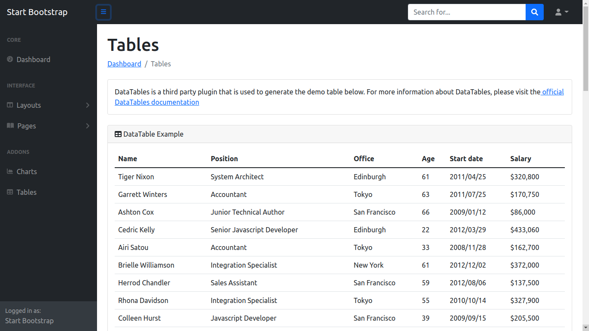

# Bootsrap to React

> The Objective is to divide a bootstrap website into a component based web app through React

Bootstrap CSS is downloaded inside a stylesheet file and imported from a public HTML file in react. Some icons and javascript features are imported through CDN

## Built With

- Major languages: HTML5, CSS3, JSX, and Javascript 
- Frameworks: React
- Technologies used: create-react-app, VsCode

## Getting Started

To get a local copy up and running follow these simple example steps.

### Prerequisites
  To get this project up and running locally, you must have nodeJs

# Step 1
   Navigate through the local folder where you want to clone the repository and run
   ``git clone https://github.com/tahiry-dev/bootstrap-2-react.git``

# Step 2
  get inside the local folder where you cloned the repository

# Step 3
  Run ``npm install`` to install the npm packages from the ``package.json`` file.

# Step 4
  Run ``npm start`` to start the application, you can now navigate to http://localhost:3000 to enjoy it!

## Authors

👤 **Tahiry RANDRIAMIARINTSOA**

- GitHub: [@tahiry-dev](https://github.com/tahiry-dev)
- LinkedIn: [Tahiry](https://www.linkedin.com/in/tahiry-randriamiarintsoa/)

## 🤝 Contributing

Contributions, issues, and feature requests are welcome!

Feel free to check the [issues page](issues/).

## Show your support

Give a ⭐️ if you like this project!

## Acknowledgments

- nice icon by fonteawesome 
- bootstrap design by [Mr nyhasina](https://github.com/nyhasina)

## 📝 License

This project is [MIT](lic.url) licensed.
